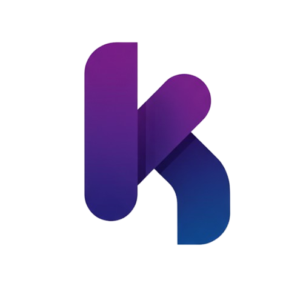

  <h1>Hi there, I'm Dylan 👋</h1>
  <h3>Founder @ Kivo Studio</h3>
  
<i>Software Engineer in Training | Full Stack Developer passionate about building modern, high-performance web applications.</i>

  

    
    
    
  

---

### 📖 About Me

I am a developer focused on creating efficient and scalable solutions using modern web technologies. I enjoy architecting clean frontends and robust backends, always striving for the best user experience and performance.

- 🚀 **Currently focused on:** Mastering **Astro** for high-performance static sites.
- 🛠️ **Main stack:** Building interactive UIs with **React** and **Tailwind CSS**.
- 🌐 **Backend:** Developing scalable APIs with **Node.js**.
- 📈 **Continuous Learning:** Deepening my knowledge in **TypeScript** and software architecture.

---

### 🎯 Mission

My primary focus is to architect and develop scalable, high-value software solutions that solve real-world business problems. I am passionate about creating tools that streamline operations and help businesses thrive in the digital landscape.

---

### 🏢 Current Venture: **Kivo Studio**

<table border="0">
  <tr>
    <td width="200">
      
    </td>
    <td>
      <strong><a href="https://kivostudio.mx">Kivo Studio</a></strong> is where I turn business challenges into digital reality. 
      Through this studio, I focus on:
      <ul>
        <li>Developing high-performance web applications.</li>
        <li>Automating business workflows with modern tech stacks.</li>
        <li>Helping startups and local businesses scale through software.</li>
      </ul>
      <a href="https://kivostudio.mx">🌐 kivostudio.mx</a>
    </td>
  </tr>
</table>

---

### 🛠️ Tech Stack & Skills

  

#### 💻 Specialized in:
- **Frontend Development:** React, Astro, Tailwind CSS, JavaScript (ES6+).
- **Backend Development:** Node.js, Express, RESTful APIs.
- **Tools & Workflow:** Git, GitHub.

---

  Built with precision by <b>Dylan Magallón (magthx)</b>

